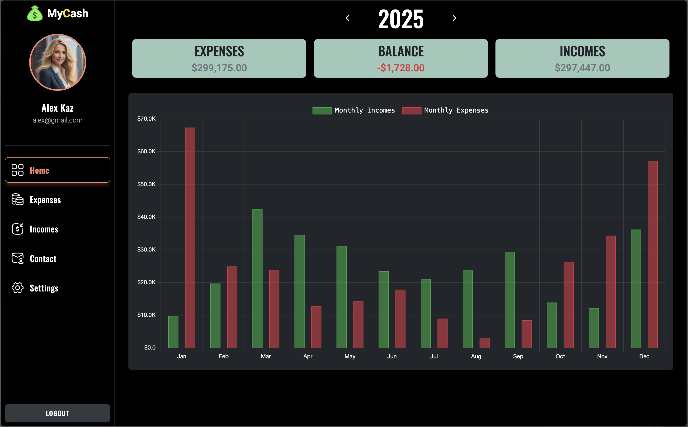
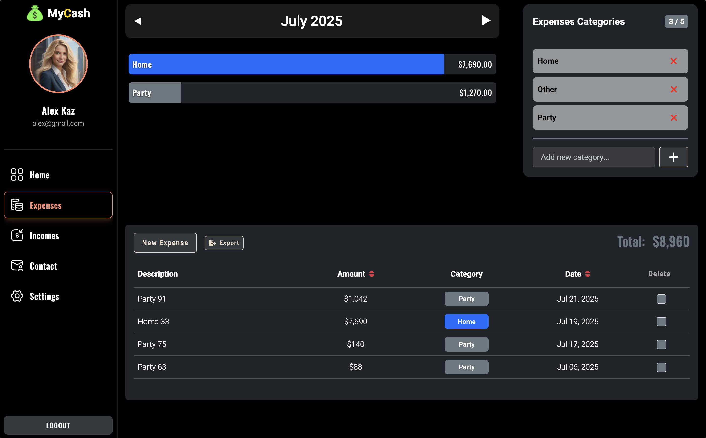
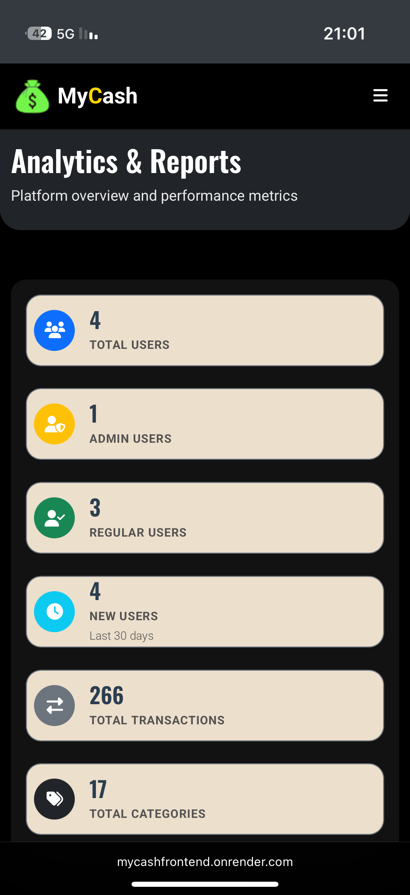
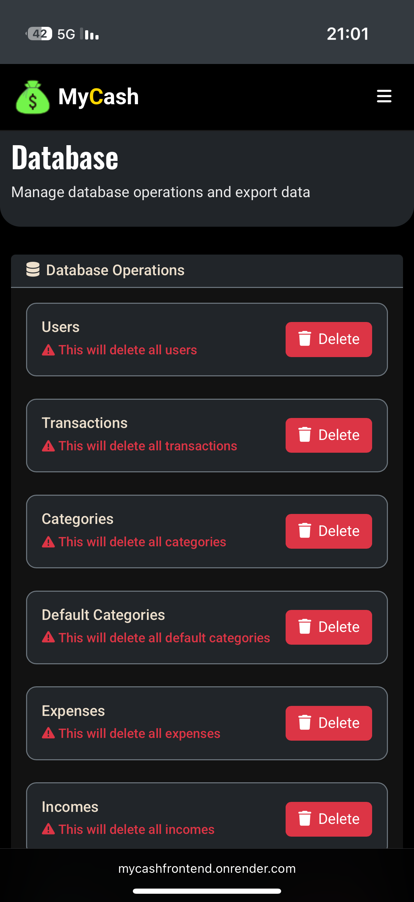

# MyCashApp - Personal Finance Tracker 💰

A modern, full-stack web application for tracking personal expenses and income with comprehensive admin panel functionality.


## 🎥 Demo Videos

<div align="center">
  <h3>👤 User Flow Demo</h3>
 https://github.com/user-attachments/assets/d0834017-f891-4b2c-8d43-1b3578c35974
  <h3>⚙️ Admin Flow Demo</h3>

  https://github.com/user-attachments/assets/90386206-3d63-46ac-9154-b24a7d15d553

</div>

## 📱 Screenshots

<div align="center">
  
  
</div>

## ✨ Key Features

### User Features

- 📊 **Transaction Management** - Track income/expenses with categories
- 📅 **Multiple Views** - Calendar month view & yearly overview
- 📈 **Analytics** - Charts, statistics, and spending insights
- 👤 **Profile Management** - Custom categories & profile image upload

### Admin Features

- 📊 **Analytics Dashboard** - System-wide statistics
- 👥 **User Management** - View, search, and manage all users
- 🗃️ **Database Tools** - Export data and bulk operations

## 🛠️ Tech Stack

**Frontend:** React 18, Redux Toolkit, Chart.js, Material-UI, Bootstrap  
**Backend:** Node.js, Express, MongoDB, JWT Auth  
**Storage:** Cloudinary (images)  
**Testing:** Cypress E2E

## 🚀 Quick Start

### Prerequisites

- Node.js (v16+)
- MongoDB
- Cloudinary account

### Installation

1. **Clone & Install**

   ```bash
   git clone <repository-url>
   cd MyCashApp

   # Install backend
   cd backend && npm install

   # Install frontend
   cd ../frontend && npm install
   ```

2. **Environment Setup**

   Create `.env` in backend directory:

   ```env
   PORT=5000
   NODE_ENV=development
   MONGO_URI=your_mongodb_connection_string
   TOKEN=your_jwt_secret
   TOKEN_EXPIRY=24h
   REFRESH_TOKEN=your_refresh_token_secret
   REFRESH_TOKEN_EXPIRY=7d

   # Cloudinary
   CLOUDINARY_CLOUD_NAME=your_cloud_name
   CLOUDINARY_API_KEY=your_api_key
   CLOUDINARY_API_SECRET=your_api_secret
   REACT_APP_CLOUDINARY_NAME=your_cloud_name
   REACT_APP_CLOUDINARY_API_KEY=your_api_key

   CLIENT_URL=http://localhost:3000
   ```

3. **Run Development**
   ```bash
   # From frontend directory - runs both frontend & backend
   npm run dev
   ```

## 👨‍💼 Admin Access

Create admin user using seed endpoint:

```bash
POST http://localhost:5000/api/seed/admin
```

Default credentials:

- Email: `cypress-ad@gmail.com`
- Password: `admin123`

## 🧪 Testing

```bash
# Run Cypress tests
cd frontend
npm run cy:test

# Open Cypress UI
npm run cy
```

## 📚 API Endpoints

### Authentication

- `POST /api/auth/signup` - Register
- `POST /api/auth/login` - Login
- `POST /api/auth/logout` - Logout

### Transactions

- `GET /api/transactions/yearly` - Yearly stats
- `GET /api/transactions/monthly` - Monthly data
- `POST /api/transactions/add` - Add transaction
- `PATCH /api/transactions/update` - Update
- `DELETE /api/transactions/delete/:id` - Delete

### Admin (Protected)

- `GET /api/admin/all` - All users
- `GET /api/admin/stats` - System stats
- `PATCH /api/admin/user/:id/role` - Change role

## 📱 Mobile Responsive

<div align="center">
  
  
  
</div>

## 🚢 Deployment

**Frontend (Render):**

- Build command: `npm run build`
- Publish directory: `build`
- Static site deployment

**Backend (Render):**

- Set all environment variables
- Start command: `npm start`
- Web service deployment

## 📞 Contact

- Email: support@mycashapp.com
- Phone: +972 052-6731280
- Issues: Create on GitHub

---

<div align="center">
  Made with ❤️ by the MyCashApp Team
</div>
